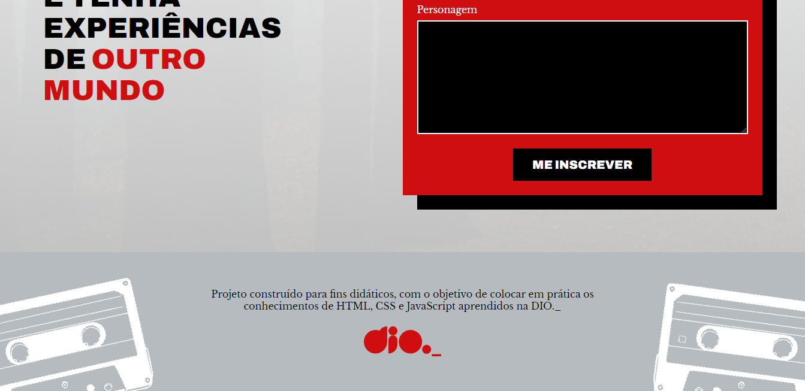

# Projeto Mundo Invertido

Este projeto fez parte da semana do Front-End realizado pela Digital Innovation One (DIO._).

## Tecnologias usadas

Para este projeto, foram usadas as tecnologias HTML, CSS E JAVASCRIPT, para a integração com o banco de dados
foi utilizado o FIREBASE.

## Funcionalidades

- Temas Dark e Light
- Inversão de elementos de acordo com o tema
- Formulário integrado com banco de dados

## Aprendizados

Construir este projeto do zero me ajudou muito a aprimorar minhas habilidades na programação,
conheci novas maneiras de criar e organizar códigos e também aprendi um pouco sobre acessibilidade nos websites.
Além de como integrar um formulário a um banco de dados não-relacional, assim salvando todos os dados inseridos.

## Screenshots

## Demonstração

 - [Abrir o Projeto](https://mundo-invertido-projeto.netlify.app/)

## Referência

 - [Projeto da Digital Innovation One](https://github.com/digitalinnovationone/semana-frontend-mundo-invertido)
 

